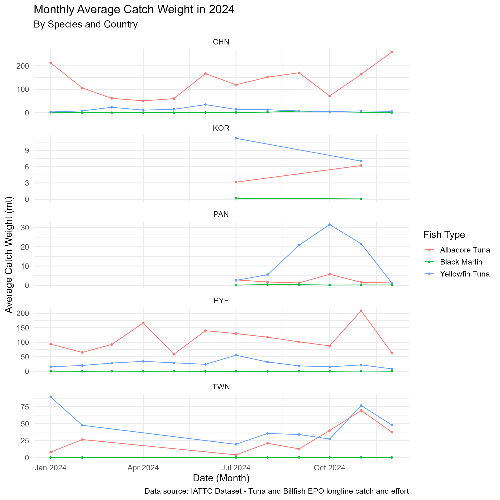
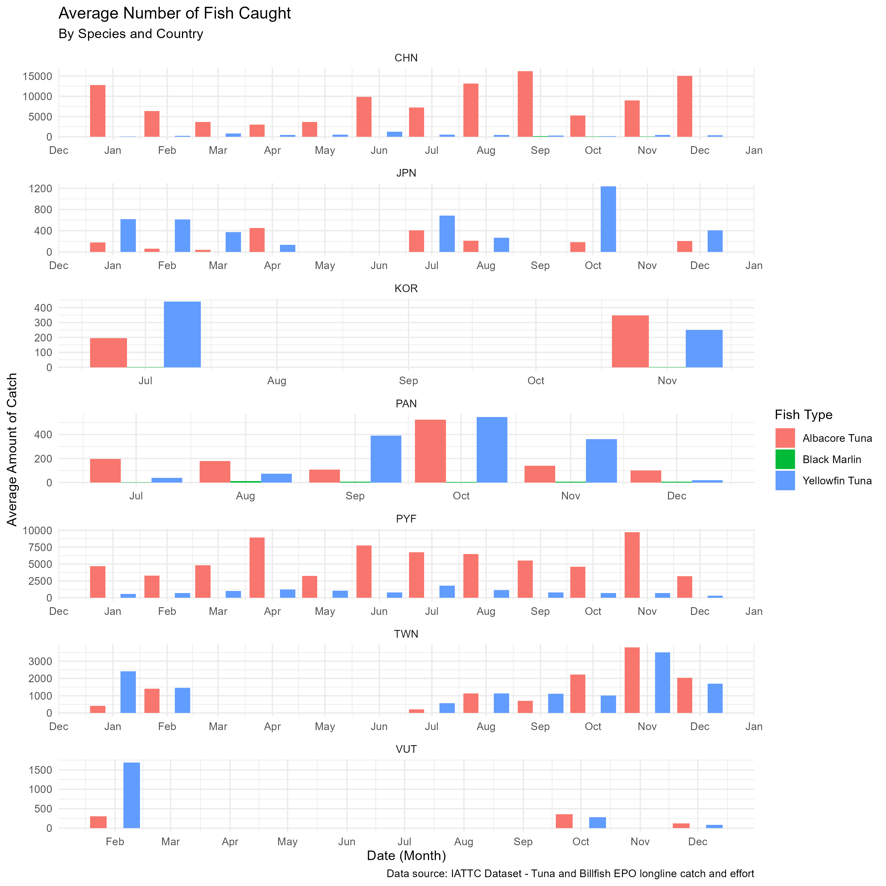

# Introduction
This project attempts to analyze tuna and billfish Eastern Pacific Ocean (EPO) longline catch data from the Inter-American Tropical Tuna Commission (IATTC).

Data contained was provided by Members and Cooperating Non-Members, on catch of tuna and billfishes in number of individuals and metric tons, and number of hooks, by year, month, flag, and 5°x5° latitude/longitude, by industrial longline vessels.

# Objectives
This project aims to analyze trends for the following fish types (Species): Albacore, Yellowfin, and Black Marlin.

* Generate 2024 catch summaries aggregated by species and country, including: 
  + Monthly Average Catch Weight.
  + Average Number of Fish Caught.
  
* Visualize:
  + The overall amount of catch caught in 2024 in the Eastern Pacific Ocean.

# Data Source {.scrollable}
Data comes from:

* Inter-American Tropical Tuna Commission (IATTC) - Public Domain for Data Download
  + Published: September 2025
  + Click [link](https://www.iattc.org/en-US/Data/Public-domain)
  
Data Sets/ Files:

* PublicLLTunaBillfishMt.csv
* PublicLLTunaBillfishNum.csv

Variables:

* Date    - Date      - Year-Month; XXXX-XX-XX
* Flag    - Character - Renamed to 'Country'; Abbreviation of country name
* LatC5   - Numeric   - Latitude
* LonC5   - Numeric   - Longitude
* [Spp]mt - Numeric   - Weight of indicated species type (metric ton)
* [Spp]n  - Numeric   - Amount of individual fish caught (count)

* Species - Character - Fish Type: ALB = Albacore, YFT = Yellowfin, BLM = Black marlin
* Flag Codes Standard ISO-3166 codes used by the IATTC in its documents and publications. For further information on those codes, see <https://www.iattc.org/en-US/Data/Reference-codes>

# Data Processing
##  Building Data for Use

Raw data sets were transformed doing the following:

1. Create single column called 'date' (XXXX-XX-XX). Combining the Year and Month.
2. Filter data to only represent fish of choice: (Albacore = ALB, Yellowfin = YFT, & Black Marlin = BLM)
3. Filter data to only provide year 2024.
4. Framing data to provide the following by species:
    i) Monthly Average Weight (mt)
    ii) Monthly Average Catch (num)
```{r}
# Load Packages -----------------------------------------------------------

library(EVR628tools)
library(tidyverse)
library(dplyr)
library(janitor)
library(lubridate)

library(cowplot)
library(ggridges)

# Loading Data ------------------------------------------------------------
tuna_and_billfish_mt <- read_csv("data/raw/PublicLLTunaBillfishMt.csv")

tuna_and_billfish_num <- read_csv("data/raw/PublicLLTunaBillfishNum.csv")

# Build Data for Use ------------------------------------------------------

##  Cleaning/ Wrangling Data set to provide the average catch weight (mt) & amount (n) of by month & country
##  for the 3 selected Species (Albacore = ALB, Yellowfin = YFT, & Black Marlin = BLM) in the year 2024.
tuna_and_billfish_mt <- read_csv("data/raw/PublicLLTunaBillfishMt.csv")|>
  rename(Country = Flag) |>
  mutate(date = make_date(year = Year, month = Month, day = 1))

tuna_and_billfish_num <- read_csv("data/raw/PublicLLTunaBillfishNum.csv")|>
  rename(Country = Flag) |>
  mutate(date = make_date(year = Year, month = Month, day = 1))


target_fish_mt <- tuna_and_billfish_mt |> 
  select(date, Country, LonC5, LatC5, Hooks, ALBmt, YFTmt, BLMmt) |>
  filter(ALBmt > 0, YFTmt > 0, BLMmt > 0,
         date >= "2024-01-01") |>
  group_by(date, Country) |>
  pivot_longer(cols = c(ALBmt, YFTmt, BLMmt), ## Using Pivot Longer function so fish type (species) can be in 1 column.
               names_to = "Fish Weight",
               values_to = "Catch_mt")

target_fish_num <- tuna_and_billfish_num |> 
  select(date, Country, LonC5, LatC5, Hooks, ALBn, YFTn, BLMn) |>
  filter(ALBn > 0, YFTn > 0, BLMn > 0,
         date >= "2024-01-01") |>
  group_by(date, Country) |>
  pivot_longer(cols = c(ALBn, YFTn, BLMn), ## Using Pivot Longer function so fish type (species) can be in 1 column.
               names_to = "Fish Amount",
               values_to = "Catch_num")

avg_monthly_fish_wt <- target_fish_mt |>
  group_by(date, Country, `Fish Weight`) |>
  summarise(avg_catch_mt = mean(Catch_mt, na.rm = TRUE))

avg_monthly_fish_num <- target_fish_num |>
  group_by(date, Country, `Fish Amount`) |>
  summarise(avg_catch_num = mean(Catch_num, na.rm = TRUE))


```


# Results/ Findings
##  Tables & Figures
###  Monthly Average Catch Weight in 2024
####  Figure A.
```{r}

# Create Your Plot --------------------------------------------------------

##  Figure 1. Creating a line graph of the Avg Catch Weight (mt) over time for 3 fish species
##  for each Country.

p1 <- ggplot(data = avg_monthly_fish_wt,
       aes(x = date, y= avg_catch_mt, color = `Fish Weight`)) +
  geom_line(size = 1, linewidth = 0.5) +
  geom_point(size = 1) +
  scale_color_discrete(name = "Fish Type", labels = c("ALBmt" = "Albacore Tuna", "YFTmt" = "Yellowfin Tuna", "BLMmt" = "Black Marlin")) +
  facet_wrap(~Country, ncol = 1, scales = "free_y") +
  labs(
    title = "Monthly Average Catch Weight in 2024",
    subtitle = "By Species and Country",
    x = "Date (Month)", y = "Average Catch Weight (mt)",
    caption = "Data source: IATTC Dataset - Tuna and Billfish EPO longline catch and effort") +
  theme_minimal(base_size = 14)

```
{height=99%}

**Figure A.** displays the a timeline of the monthly catch weight reported by each country in the year 2024. Fish type (species) is indicated by the color lines, demonstrating the trends over time for the provided data points. Black marlin tended to have a lower average catch weight when compared to Albacore tuna and Yellowfin tuna. Overall there seems to be some increase in monthly average catch weight for Albacore Tuna and Yellowfin Tuna during the autumn season followed by a decrease a the end of winter.

## Tables & Figures
###  Average Amount of Fish Caught in 2024
####  Figure B.
```{r}

##  Figure 2. Creating a bar chart of the Average Amount of Fish Caught for 3 fish species
##  by country for the year 2024. 

p2 <- ggplot(data = avg_monthly_fish_num,
       aes(x = date, y = avg_catch_num, fill = `Fish Amount`)) +
  geom_col(position = "dodge", alpha = 1) +
  facet_wrap(~Country, scales = "free", ncol = 1) +
  scale_x_date(date_breaks = "1 month", date_labels = "%b") +
  labs(title = "Average Number of Fish Caught",
       subtitle = "By Species and Country",
       x = "Date (Month)",
       y = "Average Amount of Catch",
       caption = "Data source: IATTC Dataset - Tuna and Billfish EPO longline catch and effort") +
  scale_fill_discrete(name = "Fish Type",
                    labels = c("ALBn" = "Albacore Tuna", "YFTn" = "Yellowfin Tuna", "BLMn" = "Black Marlin")) +
  theme_minimal()

```
{height=99%}

**Figure B.** displays the average amount of fish caught per month in the year 2024. Fish type (species) is indicated by the color bars. Albacore Tuna looks to be the dominating type of catch followed by Yellofin Tuna, then Black Marlin. Across countries, average catch amount was its highest during late summer and fall. 


##  Map Visualizations  

Visualizations below display a heat map of overall catch amount for each fish type in the East Pacific Ocean for the year 2024. Higher catch amount is represented by lighter color shade while lower catch amount is a darker color shade.

```{r}
# Loading Packages --------------------------------------------------------
library(EVR628tools)   # For fishing effort data and color palettes
library(ggspatial)     # To add map elements to a ggplot
library(rnaturalearth) # To add country outlines
library(tidyverse)     # General data wrangling
library(sf)            # Working with vector data
library(terra)         # Working with raster data
library(tidyterra)     # Working with raster data in tidy approach
library(mapview)       # To quickly inspect data


# Loading Data ------------------------------------------------------------

tuna_and_billfish_num <- read_csv("data/raw/PublicLLTunaBillfishNum.csv")|>
  rename(Country = Flag) |>
  mutate(date = make_date(year = Year, month = Month, day = 1))

target_fish_num <- tuna_and_billfish_num |> 
  select(date, Country, LonC5, LatC5, Hooks, ALBn, YFTn, BLMn) |>
  filter(ALBn > 0, YFTn > 0, BLMn > 0,
         date >= "2024-01-01") |>
  group_by(date, Country) |>
  pivot_longer(cols = c(ALBn, YFTn, BLMn), ## Using Pivot Longer function so fish type (species) can be in 1 column.
               names_to = "Fish Amount",
               values_to = "Catch_num")

# Building Data for Use ---------------------------------------------------
##  Converting data to sf
target_fish_sf <- target_fish_num |>
  st_as_sf(coords = c("LonC5", "LatC5"), crs=4326, remove = FALSE)

##  Coverting to Vector
target_fish_vector <- vect(target_fish_sf)

## Setting up Plot
r_template <- rast(ext(target_fish_vector), resolution = 1, crs = "EPSG:4326")

##  Rasterizing; For each species type
### Albacore (ALB)
alb_vect <- target_fish_vector[target_fish_vector$`Fish Amount`== "ALBn"]
alb_rast <- rasterize(alb_vect, r_template, field = "Catch_num", fun = "sum")

### YELLOWFIN
yft_vect <- target_fish_vector[target_fish_vector$`Fish Amount`== "YFTn"]
yft_raster <- rasterize(yft_vect, r_template, field = "Catch_num", fun = "sum")

### BLACK MARLIN
blm_vect <- target_fish_vector[target_fish_vector$`Fish Amount`== "BLMn"]
blm_raster <- rasterize(blm_vect, r_template, field = "Catch_num", fun = "sum")

##  Defining Map Features/ Attributes

world <- ne_countries(scale = "medium", returnclass = "sf")

# Building Map - For Species of Interest (ALB, YFT, BLM) ------------------
## Using geom_spatraster()

ALBmap1 <- ggplot() +
  geom_sf(data = world, fill = "gray90", color = "black") +
  geom_spatraster(data = alb_rast) +
  scale_fill_viridis_c(name = "Albacore Catch (num)", option = "magma", na.value = "transparent") + # Modifying scale title and color
  coord_sf(xlim = c(100, -140), ylim = c(-40, 60), expand = FALSE) + # Zooming in on map
  annotation_north_arrow(location = "tr") + #Adding in North Arrow
  annotation_scale(location = "br") + #Adding scale bar
  scale_x_continuous(expand = c(0, 0)) +
  scale_y_continuous(expand = c(0, 0)) +
  labs(
    title = "Albacore Catch in 2024",
    subtitle = "Heat map of overall amount of Albacore caught in E. Pacific in 2024",
    x = "Longitude",
    y = "Latitude",
    caption = "Source: IATTC Dataset - Tuna and Billfish EPO Longline Catch and Effort") + # Figure Labels
  theme_minimal(base_size = 14)
ALBmap1

YFTmap1 <- ggplot() +
   geom_sf(data = world, fill = "gray90", color = "black") +
   geom_spatraster(data = yft_raster) +
   scale_fill_viridis_c(name = "Yellowfin (num)", option = "magma", na.value = "transparent") + # Modifying scale title and color
   coord_sf(xlim = c(100, -140), ylim = c(-40, 60), expand = FALSE) + # Zooming in on map
   annotation_north_arrow(location = "tr") + #Adding in North Arrow
   annotation_scale(location = "br") + #Adding scale bar
   scale_x_continuous(expand = c(0, 0)) +
   scale_y_continuous(expand = c(0, 0)) +
   labs(
     title = "Yellowfin Catch in 2024",
     subtitle = "Heat map of overall amount of Yellowfin caught in E. Pacific in 2024",
     x = "Longitude",
     y = "Latitude",
     caption = "Source: IATTC Dataset - Tuna and Billfish EPO Longline Catch and Effort") + # Figure Labels
   theme_minimal(base_size = 14)
YFTmap1

BLMmap1 <- ggplot() +
  geom_sf(data = world, fill = "gray90", color = "black") +
  geom_spatraster(data = blm_raster) +
  scale_fill_viridis_c(name = "Black Marlin (num)", option = "magma", na.value = "transparent") + # Modifying scale title and color
  coord_sf(xlim = c(100, -140), ylim = c(-40, 60), expand = FALSE) + # Zooming in on map
  annotation_north_arrow(location = "tr") + #Adding in North Arrow
  annotation_scale(location = "br") + #Adding scale bar
  scale_x_continuous(expand = c(0, 0)) +
  scale_y_continuous(expand = c(0, 0)) +
  labs(
    title = "Black Marlin Catch in 2024",
    subtitle = "Heat map of overall amount of Black Marlin caught in E. Pacific in 2024",
    x = "Longitude",
    y = "Latitude",
    caption = "Source: IATTC Dataset - Tuna and Billfish EPO Longline Catch and Effort") + # Figure Labels
  theme_minimal(base_size = 14)
BLMmap1
```

# References
This presentation contains data from:

*The Inter-American Tropical Tuna Commission (IATTC) - Public Domain for Data Download (September 2025). <https://www.iattc.org/en-US/Data/Public-domain>